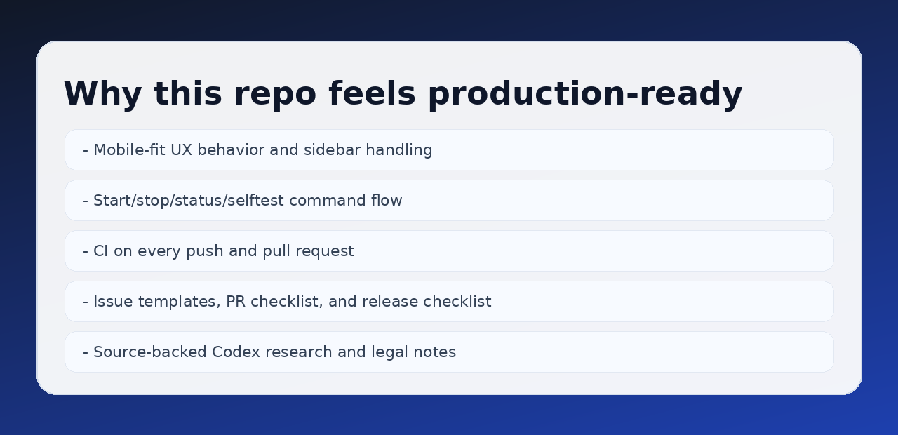
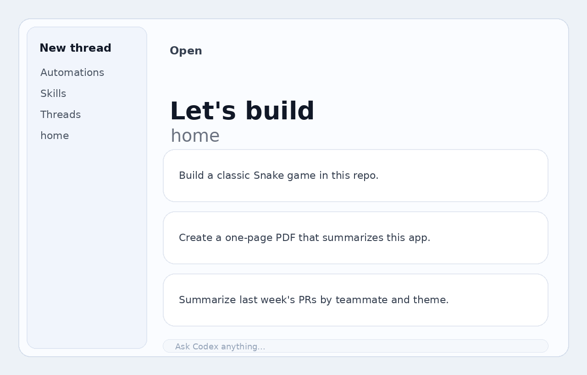
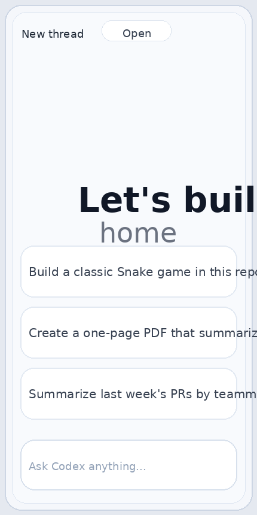
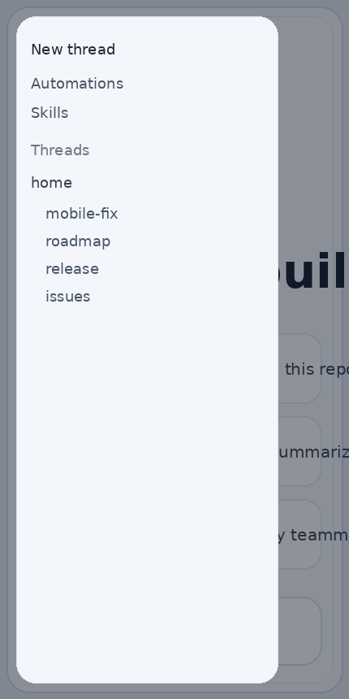
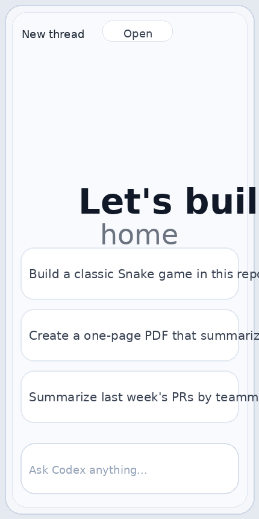

# Codex Web App


Run a Codex-style web app locally with strong mobile behavior, one-command runtime controls, and CI checks that keep regressions out.


## 30-Second Quick Win

```bash
git clone https://github.com/siegaarjay-hue/codex-web-app.git
cd codex-web-app
npm install
npm run start
```

Open `http://127.0.0.1:8000/`

Then stop:

```bash
npm run stop
```

## Why People Like This Repo

- Mobile-first behavior is built in, including sidebar handling and overlap prevention.
- Local workflow is simple: `start`, `stop`, `status`, `selftest`.
- CI runs every push/PR and validates both unit and end-to-end checks.
- Clear contributor flow with issue templates, PR checklist, and release checklist.
- Research and legal notes are documented for safer public sharing.



## Product Preview

### Desktop


### Mobile



### Sidebar Motion


## Commands

```bash
npm run serve      # run in foreground
npm run start      # run in background
npm run status     # show runtime state
npm run stop       # stop background process
npm run selftest   # run end-to-end checks
npm run test       # run unit tests
npm run check      # test + selftest
```

## CI Quality Gate

GitHub Actions runs on every push and pull request to `master`:

- `npm ci`
- `npm run test`
- `npm run selftest`

Workflow file: `.github/workflows/ci.yml`

## Mobile UX Focus

Mobile support is not an afterthought. The project includes dedicated mobile override behavior:

- viewport-safe spacing
- touch-target friendly controls
- sidebar open/close state handling
- overlap prevention across narrow screens

Reference: `assets/mobile-overrides.css`

## Project Layout

- `index.html`: app entrypoint
- `assets/`: bundled JS/CSS/fonts/images
- `apps/`, `colorcons/`: icon and UI media assets
- `scripts/server.mjs`: static + API server
- `scripts/codex-web.mjs`: runtime command wrapper
- `tests/server.test.mjs`: API and security regression tests
- `scripts/generate_media.py`: preview media generator

## API Endpoints

- `GET /healthz`: liveness payload with service name + timestamp
- `GET /api/files`: download manifest with SHA256 and metadata
- `GET|HEAD /downloads/:file`: static download with range support

## Trust, Legal, and Sources

- Research references: `docs/RESEARCH.md`
- Legal and attribution: `docs/LEGAL.md`
- Notice file: `NOTICE`

## Contributing

Before opening a PR:

1. Run `npm run check`
2. Verify mobile layout behavior
3. Update docs if behavior changed

Full guide: `CONTRIBUTING.md`

## Roadmap and Release Process

- Roadmap: `docs/ROADMAP.md`
- Release checklist: `docs/RELEASE_CHECKLIST.md`
- Changelog: `CHANGELOG.md`

## Security

Please report vulnerabilities through `SECURITY.md`.
