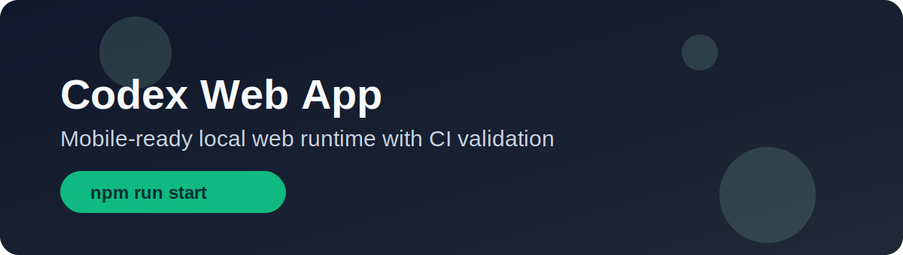
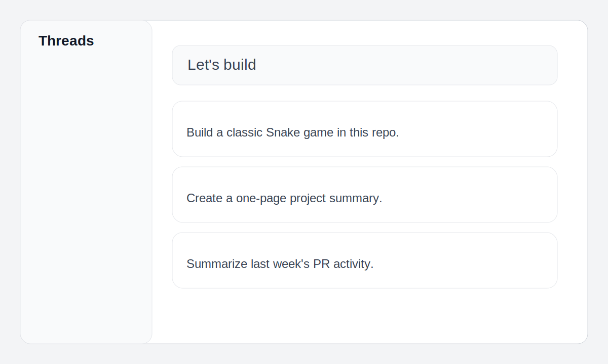
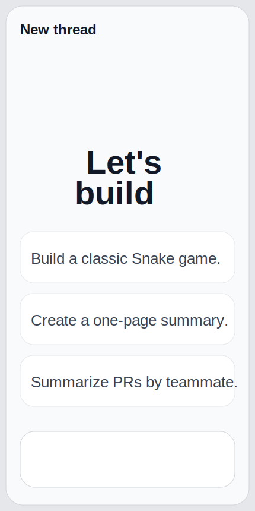

# Codex Web App


Local website packaging of a Codex-style web app with mobile-fit behavior, one-command runtime controls, and CI-backed checks.



## Why This Repo

- Mobile-friendly overrides are included and enabled by default (`assets/mobile-overrides.css`).
- Local process controls are simple (`start`, `stop`, `status`, `selftest`).
- Health and file APIs make it easy to monitor and automate (`/healthz`, `/api/files`).
- Automated checks run locally and in GitHub Actions.

## Quick Start

```bash
cd codex-web-app
npm install
npm run start
```

Open `http://127.0.0.1:8000/`.

Stop it:

```bash
npm run stop
```

## Commands

```bash
npm run serve      # run in foreground
npm run start      # run in background
npm run status     # show runtime state
npm run stop       # stop background process
npm run selftest   # run end-to-end checks
npm run test       # run unit tests
npm run check      # test + selftest
```

## CI Quality Gate

GitHub Actions runs on every push and pull request to `master`:

- `npm ci`
- `npm run test`
- `npm run selftest`

## Screenshots




## Project Layout

- `index.html`: entrypoint for the bundled web app.
- `assets/`: bundled JS/CSS/fonts/images.
- `apps/`, `colorcons/`: icon assets used by the UI.
- `scripts/server.mjs`: static + API server.
- `scripts/codex-web.mjs`: runtime command wrapper.
- `tests/server.test.mjs`: API and security regression tests.
- `.github/workflows/ci.yml`: CI checks for every push/PR.

## API Endpoints

- `GET /healthz`: liveness payload with service name + timestamp.
- `GET /api/files`: download manifest with SHA256 and metadata.
- `GET|HEAD /downloads/:file`: static download with range support.

## Mobile UX Notes

This repo ships with a dedicated mobile override stylesheet:

- viewport-safe spacing
- no panel overlap
- touch-safe controls
- sidebar state behavior tuned for narrow screens

File: `assets/mobile-overrides.css`

## Research Notes

Official Codex/OpenAI references that informed this repo documentation are tracked in `docs/RESEARCH.md` with retrieval dates and links.

## Roadmap

Planned work is tracked in `docs/ROADMAP.md` and release hygiene in `docs/RELEASE_CHECKLIST.md`.

## Legal

Read `docs/LEGAL.md` and `NOTICE` before redistributing this repository publicly.

## Contributing

Read `CONTRIBUTING.md` before opening a PR.

## Security

Please report issues using `SECURITY.md`.
