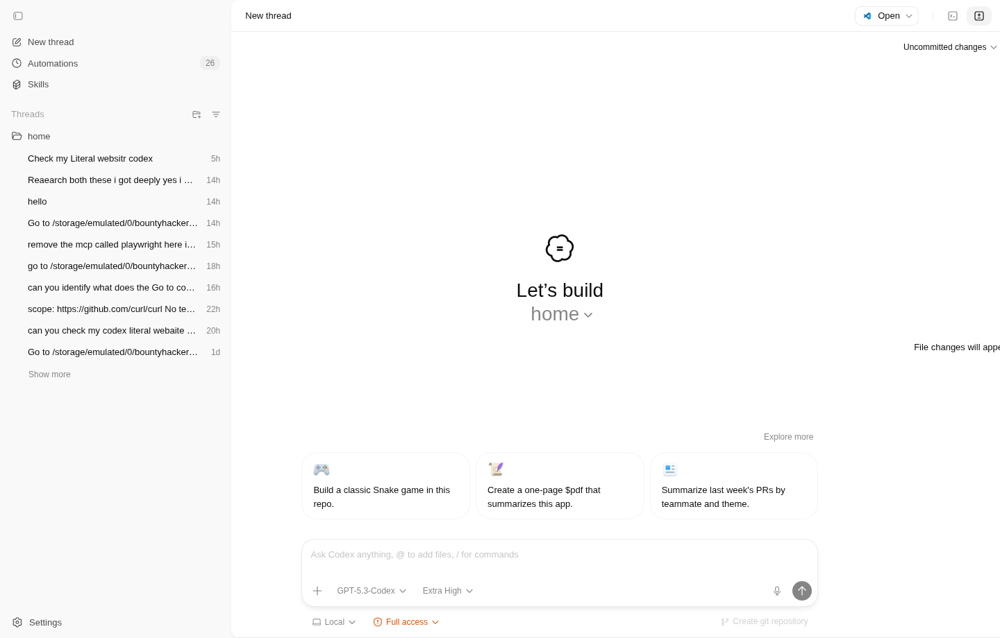
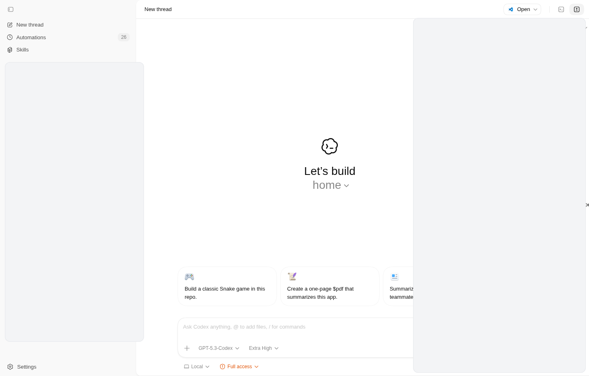
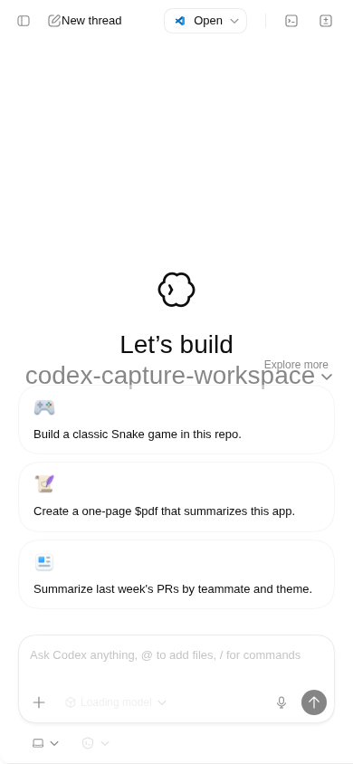
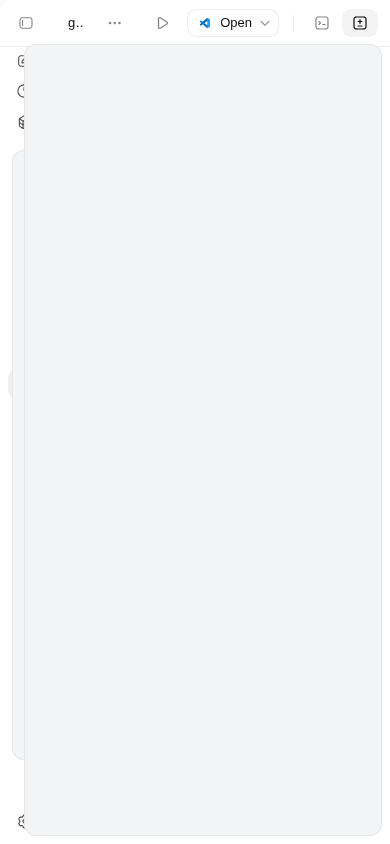
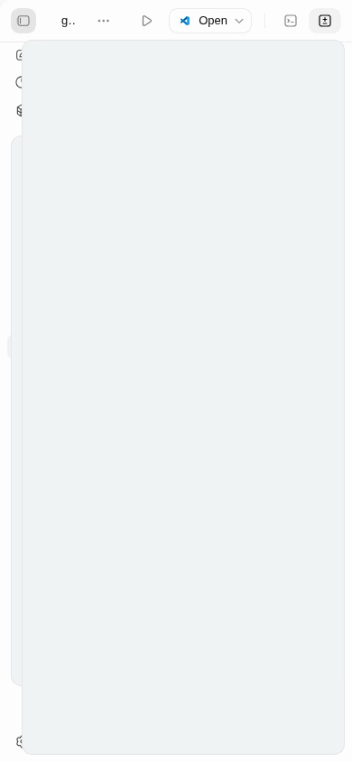

# Codex Web App


Community-built Codex-style web app runtime with a focus on one thing: clean behavior on real phones.

No mockups in this README. Every screenshot and animation below was captured from a running literal bridge session.



## Quick Start

```bash
git clone https://github.com/siegaarjay-hue/codex-web-app.git
cd codex-web-app
npm install
npm run start
```

Open `http://127.0.0.1:8000/` and run `npm run status` to verify runtime health.

Stop anytime:

```bash
npm run stop
```

## Why This Repo Feels Production-Ready

- Mobile sidebar open/close flow is handled explicitly to prevent overlap regressions.
- Runtime controls are simple and memorable: `start`, `stop`, `status`, `selftest`.
- CI enforces quality on every push and pull request to `main`.
- Real media capture pipeline keeps README proof honest and reproducible.
- Contributing docs, issue templates, and release checklist are already in place.

## Real Product Captures

### Desktop


### Mobile



### Sidebar Motion (Real)


[Download the real MP4 capture (redacted)](docs/media/real-mobile-sidebar-demo-redacted.mp4)

## Commands

```bash
npm run serve         # run in foreground
npm run start         # run in background
npm run status        # show runtime state
npm run stop          # stop background process
npm run test          # node unit/integration tests
npm run selftest      # end-to-end command health check
npm run check:media   # verify README media links are valid
npm run check         # test + selftest + media validation
npm run capture:real  # regenerate real screenshots/gif/mp4
```

## Real Media Capture Workflow

Start the literal web bridge (clean capture session):

```bash
cd /data/data/com.termux/files/home/Codex-App-Linux/codex-linux
./codex-literal-web.sh start
```

Then regenerate all real README media:

```bash
cd /data/data/com.termux/files/home/codex-web-app
npm run capture:real
```

Outputs are written to `docs/media/`:

- `real-desktop-home.png`
- `real-desktop-sidebar-redacted.png`
- `real-mobile-home.png`
- `real-mobile-sidebar-open-redacted.png`
- `real-mobile-sidebar-demo-redacted.gif`
- `real-mobile-sidebar-demo-redacted.mp4`

Troubleshooting:

- If captures show loading states, run `npm run capture:real` again after bridge health is stable (`curl http://127.0.0.1:6070/healthz`).

## Good First Issues

- [#1 Add visual regression test for mobile sidebar behavior](https://github.com/siegaarjay-hue/codex-web-app/issues/1)
- [#2 Document real media capture workflow for README assets](https://github.com/siegaarjay-hue/codex-web-app/issues/2)
- [#3 Add npm script for real capture and media sanity check](https://github.com/siegaarjay-hue/codex-web-app/issues/3)
- [#4 Improve first-time contributor experience in CONTRIBUTING.md](https://github.com/siegaarjay-hue/codex-web-app/issues/4)

## CI Quality Gate

GitHub Actions runs on every push and pull request to `main`:

- `npm ci`
- `npm run check`

Workflow file: `.github/workflows/ci.yml`

## Project Layout

- `index.html`: app entrypoint
- `assets/`: bundled JS/CSS/fonts/images
- `scripts/server.mjs`: static + API server
- `scripts/codex-web.mjs`: runtime command wrapper
- `scripts/capture_real_media.mjs`: real screenshot/gif/mp4 capture script
- `scripts/check-readme-media.mjs`: README media link validator
- `tests/server.test.mjs`: API and security regression tests

## API Endpoints

- `GET /healthz`: liveness payload with service name + timestamp
- `GET /api/files`: download manifest with SHA256 and metadata
- `GET|HEAD /downloads/:file`: static download with range support

## Trust, Legal, and Sources

- Research references: `docs/RESEARCH.md`
- Legal and attribution: `docs/LEGAL.md`
- Notice file: `NOTICE`

## Contributing

Before opening a PR:

1. Run `npm run check`
2. Validate behavior at mobile widths (360px, 390px, 430px)
3. Update docs when behavior changes

Full guide: `CONTRIBUTING.md`

## Roadmap and Release Process

- Roadmap: `docs/ROADMAP.md`
- Release checklist: `docs/RELEASE_CHECKLIST.md`
- Changelog: `CHANGELOG.md`

## Security

Please report vulnerabilities through `SECURITY.md`.
