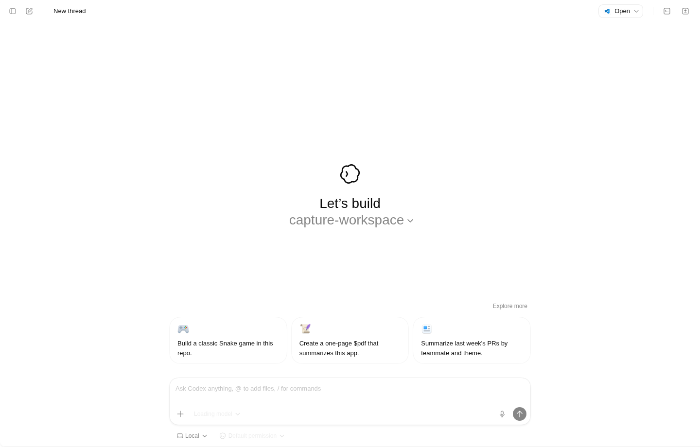
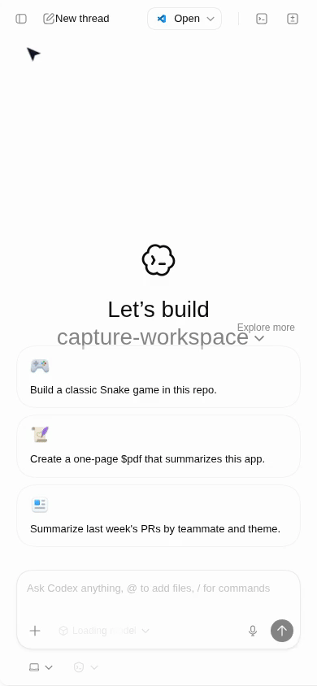

<div align="center">

# 🌐 Codex Web App

**A community-built, mobile-first web interface for the Codex runtime — with local tooling, runtime controls, and a responsive UI that works beautifully on any device.**

[](https://github.com/siegaarjay-hue/codex-web-app/actions/workflows/ci.yml)


<br />



</div>

---

## ✨ Features

- 📱 **Mobile-first UI** — responsive layout tuned for 360px–430px viewports and beyond
- 🖥️ **Desktop-ready** — sidebar and panel handling that adapts gracefully to wider screens
- ⚡ **Runtime controls** — `start`, `stop`, `status`, and `selftest` via simple npm scripts
- 🔒 **Security-hardened** — Content Security Policy, path traversal protection, and input validation
- 📦 **Download API** — file manifest with SHA-256 integrity checksums and HTTP range support
- 🩺 **Health endpoint** — `/healthz` for liveness checks and monitoring
- 🧪 **CI pipeline** — automated tests, self-tests, and public-readiness checks on every push
- 📖 **Community-ready** — issue templates, PR template, code of conduct, and contributor guide

---

## 🛠️ Tech Stack

| Layer | Technology |
|-------|-----------|
| **Runtime** | [Node.js](https://nodejs.org/) ≥ 20 (ES Modules) |
| **Server** | Zero-dependency `node:http` static + API server |
| **Frontend** | Pre-built Vite bundle (HTML / CSS / JS) |
| **Testing** | Node.js built-in test runner (`node --test`) |
| **CI/CD** | GitHub Actions |
| **Process Mgmt** | Custom daemon with PID file and log rotation |

---

## 🚀 Getting Started

### Prerequisites

- **Node.js** ≥ 20 — [Download](https://nodejs.org/)
- **npm** (ships with Node.js)

### Installation

```bash
git clone https://github.com/siegaarjay-hue/codex-web-app.git
cd codex-web-app
npm install
```

### Running the App

**Foreground mode** (logs to stdout):

```bash
npm run serve
```

**Background mode** (daemonized):

```bash
npm run start
```

Then open **http://127.0.0.1:8000/** in your browser.

Check runtime health:

```bash
npm run status
```

Stop the background server:

```bash
npm run stop
```

---

## 📋 Available Commands

| Command | Description |
|---------|-------------|
| `npm run serve` | Run server in foreground |
| `npm run start` | Run server in background (daemonized) |
| `npm run stop` | Stop background server |
| `npm run status` | Show runtime state and health |
| `npm run test` | Run unit/integration tests |
| `npm run selftest` | End-to-end validation (health, downloads, integrity) |
| `npm run check:public` | Verify public-readiness guardrails |
| `npm run check` | Run all checks (test + selftest + public + media validation) |
| `npm run capture:real` | Capture real screenshots/GIF/MP4 from the web bridge |
| `npm run check:media` | Verify README media references are valid and not legacy |

---

## 🗂️ Project Structure

```
codex-web-app/
├── index.html                  # App entrypoint
├── assets/                     # Bundled JS, CSS, fonts, and images
├── apps/                       # Application icon assets
├── downloads/                  # Downloadable files (auto-created)
├── scripts/
│   ├── server.mjs              # Static file + API server
│   ├── codex-web.mjs           # Runtime command wrapper (start/stop/status)
│   └── check-public-ready.mjs  # Public-readiness guardrail checks
├── tests/
│   └── server.test.mjs         # API and security regression tests
├── docs/
│   ├── LEGAL.md                # Legal and attribution
│   ├── PRIVACY.md              # Privacy notes
│   ├── RESEARCH.md             # Research references
│   ├── ROADMAP.md              # Project roadmap
│   └── RELEASE_CHECKLIST.md    # Release process
└── .github/
    ├── workflows/ci.yml        # CI pipeline
    ├── dependabot.yml          # Dependency updates
    ├── pull_request_template.md
    └── ISSUE_TEMPLATE/         # Bug report & feature request templates
```

---

## 🔌 API Endpoints

| Method | Path | Description |
|--------|------|-------------|
| `GET` | `/healthz` | Liveness check — returns `{ ok, service, now }` |
| `GET` | `/api/files` | Download manifest with SHA-256 checksums and metadata |
| `GET` / `HEAD` | `/downloads/:file` | Static file download with HTTP range support |

---

## 📸 UI Preview

<table>
  <tr>
    <td align="center"><strong>Desktop</strong></td>
    <td align="center"><strong>Mobile</strong></td>
    <td align="center"><strong>Mobile Composer</strong></td>
  </tr>
  <tr>
    <td></td>
    <td></td>
    <td></td>
  </tr>
</table>

### 🎬 Message Demo

<video src="docs/media/message-demo.mp4" width="720" controls muted>
  
</video>

---

## 🧪 Visual Regression Testing

A lightweight visual regression check (`tests/mobile-sidebar.test.mjs`) captures the mobile sidebar at `390×844` in open and closed states and compares against baseline snapshots in `tests/snapshots/mobile/`. Run it via `npm run test`; it is automatically skipped when Playwright is not installed.

---

## 📸 Capturing Real Media Assets

To regenerate the screenshots, GIF, and MP4 used in this README from a live web bridge:

1. **Start the bridge / server:**
   ```bash
   npm run serve
   ```
2. **Run the capture script** (requires Playwright and ffmpeg):
   ```bash
   npm run capture:real
   ```
   This calls `scripts/capture_media.mjs`, which launches a headless browser, captures desktop and mobile screenshots, records a message-send animation, and produces `docs/media/` assets.
3. **Output files** are saved to `docs/media/` — including `desktop-home.png`, `mobile-home.png`, `mobile-composer.png`, `message-demo.mp4`, and `message-demo.gif`.
4. **Troubleshooting:** If captures show a loading spinner instead of the home screen, increase `CODEX_CAPTURE_BOOT_TIMEOUT_MS` (default 20 000 ms) or ensure the bridge is fully booted before running the script.

---

## 🤝 Contributing

Contributions are welcome! Before opening a PR:

1. Run the full check suite:
   ```bash
   npm run check
   ```
2. Validate behavior at mobile widths (360px, 390px, 430px)
3. Update docs when behavior changes

See [`CONTRIBUTING.md`](CONTRIBUTING.md) for the full guide, including the 10-minute first contribution path.

### Good First Issues

- [#1 — Add visual regression test for mobile sidebar behavior](https://github.com/siegaarjay-hue/codex-web-app/issues/1)
- [#4 — Improve first-time contributor experience](https://github.com/siegaarjay-hue/codex-web-app/issues/4)

---

## 🔐 Security

Please report vulnerabilities through [`SECURITY.md`](SECURITY.md).

---

## 📄 License

This project is licensed under the **MIT License** — see the [`LICENSE`](LICENSE) file for details.

---

## 📚 Additional Resources

| Document | Description |
|----------|-------------|
| [`CHANGELOG.md`](CHANGELOG.md) | Version history and release notes |
| [`NOTICE`](NOTICE) | Third-party attribution |
| [`docs/ROADMAP.md`](docs/ROADMAP.md) | Project roadmap |
| [`docs/RELEASE_CHECKLIST.md`](docs/RELEASE_CHECKLIST.md) | Release process |
| [`docs/RESEARCH.md`](docs/RESEARCH.md) | Research references |
| [`docs/LEGAL.md`](docs/LEGAL.md) | Legal and attribution |
| [`docs/PRIVACY.md`](docs/PRIVACY.md) | Privacy notes |
| [`CODE_OF_CONDUCT.md`](CODE_OF_CONDUCT.md) | Community code of conduct |
